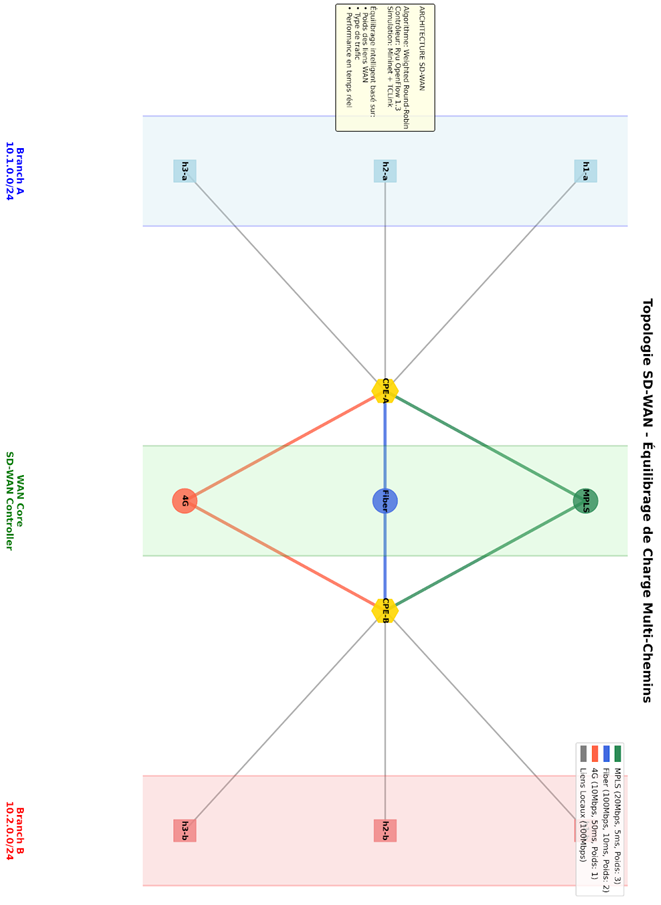
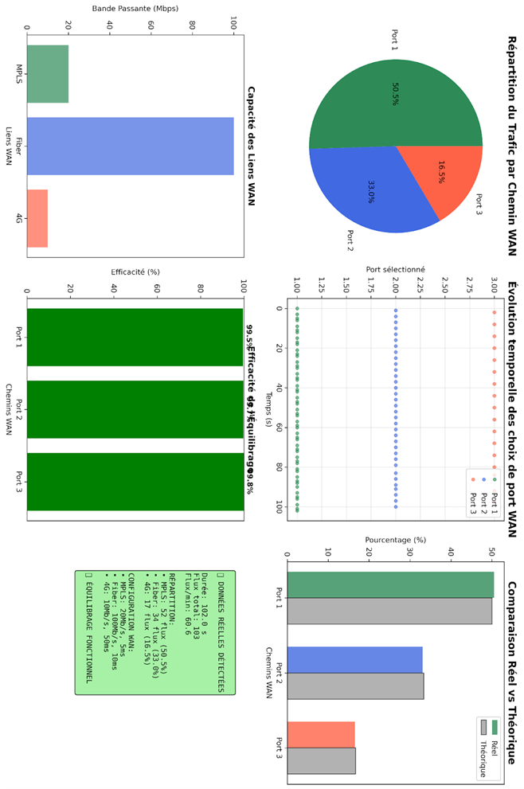

# Simulation SD-WAN Avancée avec Équilibrage de Charge

## 🎯 Objectif du Projet

Cette simulation démontre l'équilibrage de charge intelligent dans un réseau **SD-WAN** (Software-Defined Wide Area Network) en utilisant **Mininet** et **Ryu Controller**. Le projet implémente un algorithme de **Weighted Round-Robin** avec prise en compte de multiples critères (latence, bande passante, priorité).

## 🏗️ Architecture de la Simulation

### Topologie Réseau
```
Branch A (3 hôtes)          Branch B (3 hôtes)
    h1-a, h2-a, h3-a           h1-b, h2-b, h3-b
         |                           |
        s1 ======================= s2
         |                           |
    ┌────┴────┬─────────┬─────────┴──┐
    │         │         │            │
   s3        s4        s5            │
  MPLS      Fiber      4G            │
 5ms/20Mb  10ms/100Mb  50ms/10Mb     │
    │         │         │            │
    └─────────┴─────────┴────────────┘
```

### Chemins WAN Simulés
- **MPLS** : Haute priorité, faible latence (5ms), 20 Mbps, Poids: 3
- **Fiber** : Haute bande passante (100 Mbps), latence moyenne (10ms), Poids: 2  
- **4G** : Backup, haute latence (50ms), 10 Mbps, Poids: 1

## 🚀 Fonctionnalités

### Équilibrage de Charge Intelligent
- **Weighted Round-Robin** basé sur les poids configurés
- Prise en compte du type de trafic (web, vidéo, VoIP, data)
- Répartition automatique selon les performances des liens

### Types de Trafic Simulés
- **Web** : TCP, 2 Mbps, trafic en rafales
- **Vidéo** : UDP, 8 Mbps, continu
- **VoIP** : UDP, 64 Kbps, continu, priorité haute
- **Data** : TCP, 5 Mbps, transfert en bloc

### Monitoring et Visualisation
- Logs détaillés en temps réel
- Statistiques JSON horodatées
- Graphiques automatiques de performance
- Analyse d'efficacité de l'équilibrage

## 📊 Métriques et Analyses

### Graphiques Générés
1. **Répartition du trafic** : Diagramme circulaire par chemin WAN
2. **Évolution temporelle** : Courbes de flux dans le temps
3. **Comparaison réel vs théorique** : Histogrammes d'efficacité
4. **Caractéristiques des liens** : Bande passante et latence
5. **Timeline cumulative** : Évolution des flux cumulés
6. **Tableau de bord statistique** : Résumé de performance

### Métriques Calculées
- Nombre total de flux par chemin
- Pourcentage de répartition réelle vs théorique
- Efficacité de l'algorithme d'équilibrage
- Débit moyen par minute
- Respect des poids configurés

## 🛠️ Installation et Prérequis

### Système Requis
- Ubuntu 18.04+ (ou distribution Linux similaire)
- Python 3.6+
- Droits administrateur (sudo)

### Installation des Dépendances

```bash
# Mise à jour du système
sudo apt update && sudo apt upgrade -y

# Installation des paquets système
sudo apt install -y python3-pip python3-dev build-essential

# Installation de Mininet
git clone https://github.com/mininet/mininet.git
cd mininet
sudo ./util/install.sh -a
cd ..

# Installation de Ryu Controller
sudo pip3 install ryu

# Installation des dépendances Python
pip3 install -r requirements.txt
```

### Vérification de l'Installation

```bash
# Test Mininet
sudo mn --test pingall

# Test Ryu
ryu-manager --version

# Test des bibliothèques Python
python3 -c "import numpy, matplotlib; print('✓ Dépendances OK')"
```

## 🏃‍♂️ Utilisation

### 1. Démarrage du Contrôleur

```bash
# Terminal 1 - Lancement du contrôleur Ryu
ryu-manager ryu_sdwan_controller.py
```

Attendez le message de confirmation :
```
loading app ryu_sdwan_controller
instantiated app ryu_sdwan_controller
```

### 2. Lancement de la Simulation

```bash
# Terminal 2 - Simulation Mininet (avec sudo)
sudo python3 sdwan_mininet_simulation.py
```

### 3. Contrôle de la Simulation

- **Démarrage automatique** : La simulation démarre automatiquement
- **Durée** : 60 secondes par défaut (configurable)
- **Arrêt manuel** : `Ctrl+C` pour arrêt propre
- **Logs temps réel** : Visible dans la console

### 4. Interface Interactive (Optionnel)

Pour accéder à l'interface Mininet pendant la simulation :

```bash
# Dans le code, décommentez la ligne :
# CLI(net)
```

## 📁 Structure des Fichiers

```
projet_sdwan/
├── ryu_sdwan_controller.py      # Contrôleur Ryu intelligent
├── sdwan_mininet_simulation.py  # Simulation Mininet avancée
├── requirements.txt             # Dépendances Python
├── README.md                   # Cette documentation
├── logs/                       # Logs de simulation
│   ├── sdwan_controller.log    # Décisions du contrôleur
│   ├── iperf_*.log            # Métriques de trafic
├── stats/                      # Statistiques JSON
│   └── path_statistics.json   # Données temporelles
└── results/                    # Résultats d'analyse
    └── graphs/                 # Graphiques générés
        ├── sdwan_analysis_*.png
        └── timeline_cumulative_*.png
```

## ⚙️ Configuration Avancée

### Modification des Poids WAN

Dans `ryu_sdwan_controller.py` :

```python
WAN_PATHS = {
    1: {'weight': 5, 'name': 'MPLS', 'priority': 'high'},     # Plus de trafic
    2: {'weight': 3, 'name': 'Fiber', 'priority': 'medium'},  # Trafic moyen
    3: {'weight': 1, 'name': '4G', 'priority': 'low'}         # Backup
}
```

### Ajustement des Paramètres de Liens

Dans `sdwan_mininet_simulation.py` :

```python
WAN_CONFIGS = {
    'MPLS': {'bw': 50, 'delay': '2ms', 'loss': 0, 'port': 1},      # Premium
    'Fiber': {'bw': 200, 'delay': '5ms', 'loss': 0.1, 'port': 2},  # Haute BP
    '4G': {'bw': 20, 'delay': '100ms', 'loss': 5, 'port': 3}       # Mobile
}
```

### Personnalisation du Trafic

```python
# Durée de simulation
SIM_DURATION = 120  # 2 minutes

# Nombre d'hôtes par succursale
HOSTS_PER_BRANCH = 5  # Plus d'hôtes = plus de trafic

# Types de trafic personnalisés
TRAFFIC_TYPES = ['web', 'video', 'voip', 'data', 'backup', 'sync']
```

## 📈 Interprétation des Résultats

### Métriques d'Efficacité

- **Efficacité > 90%** : Excellent équilibrage
- **Efficacité 70-90%** : Bon équilibrage  
- **Efficacité < 70%** : Ajustements nécessaires

### Analyse des Graphiques

1. **Diagramme circulaire** : Vérifiez que la répartition respecte les poids (MPLS ~50%, Fiber ~33%, 4G ~17%)

2. **Évolution temporelle** : Observez la régularité de l'alternance entre chemins

3. **Comparaison réel/théorique** : Les barres doivent être proches entre réel et théorique

4. **Timeline cumulative** : Croissance proportionnelle aux poids configurés

## 🔧 Dépannage

### Problèmes Courants

**Erreur "Permission denied"**
```bash
sudo python3 sdwan_mininet_simulation.py
```

**Contrôleur non accessible**
```bash
# Vérifiez que Ryu écoute sur le bon port
netstat -an | grep 6633
```

**Graphiques non générés**
```bash
# Vérifiez matplotlib
python3 -c "import matplotlib.pyplot as plt; print('OK')"
```

**Manque de données**
```bash
# Augmentez la durée de simulation
SIM_DURATION = 120
```

### Logs de Debug

Activez le debug dans le contrôleur :
```python
logging.basicConfig(level=logging.DEBUG)
```

## 🎓 Contexte Académique

### Objectifs Pédagogiques

- Comprendre les principes SD-WAN vs SDN classique
- Implémenter un algorithme d'équilibrage de charge
- Analyser les performances de différents types de liens WAN
- Visualiser l'efficacité des décisions de routage
- Maîtriser les outils Mininet et OpenFlow/Ryu

### Critères d'Évaluation

- **Fonctionnalité** : La simulation fonctionne sans erreur
- **Réalisme** : Les paramètres de liens sont cohérents
- **Intelligence** : L'algorithme respecte les poids configurés
- **Visualisation** : Les graphiques sont informatifs et précis
- **Documentation** : Code commenté et README complet

# RESULTATS OBTENUS :

## Topologie mininet :


## Gaphiques obtenues  :


### On constate sur le diagramme a bande que les resultats experimentaux sont assez proches de ceux attendus , la repartition de flux respecte bien les poids fournies , le Round-Robin fonctionne donc correctement 

## 🚀 Extensions Possibles

### Améliorations Techniques

1. **QoS Avancée** : Priorité par type d'application
2. **Détection de pannes** : Basculement automatique en cas de perte de lien
3. **Métriques en temps réel** : Latence et débit mesurés dynamiquement
4. **Interface Web** : Dashboard temps réel avec Flask/Django
5. **Apprentissage automatique** : Optimisation des poids par IA

### Scénarios Avancés

1. **Multi-sites** : 3+ succursales avec routage complexe
2. **Trafic vidéo** : Simulation de streaming HD/4K
3. **Applications critiques** : SLA et pénalités de performance
4. **Cyber-sécurité** : Détection d'anomalies de trafic
5. **Montée en charge** : Tests avec 10+ hôtes par site

## 📚 Références

- [Mininet Documentation](http://mininet.org/walkthrough/)
- [Ryu Controller Guide](https://ryu.readthedocs.io/)
- [OpenFlow Specification](https://opennetworking.org/openflow/)
- [SD-WAN Principles](https://www.cisco.com/c/en/us/solutions/enterprise-networks/sd-wan/)

---

**Projet réalisé dans le cadre d'études sur l'équilibrage de charge dans les réseaux SD-WAN**

*Simulation complète avec 6 hôtes, 3 chemins WAN, et analyse graphique avancée*